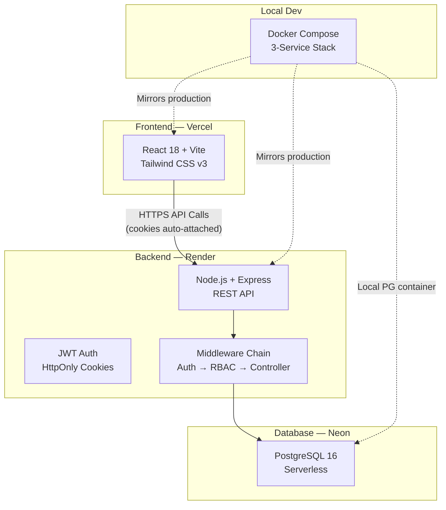
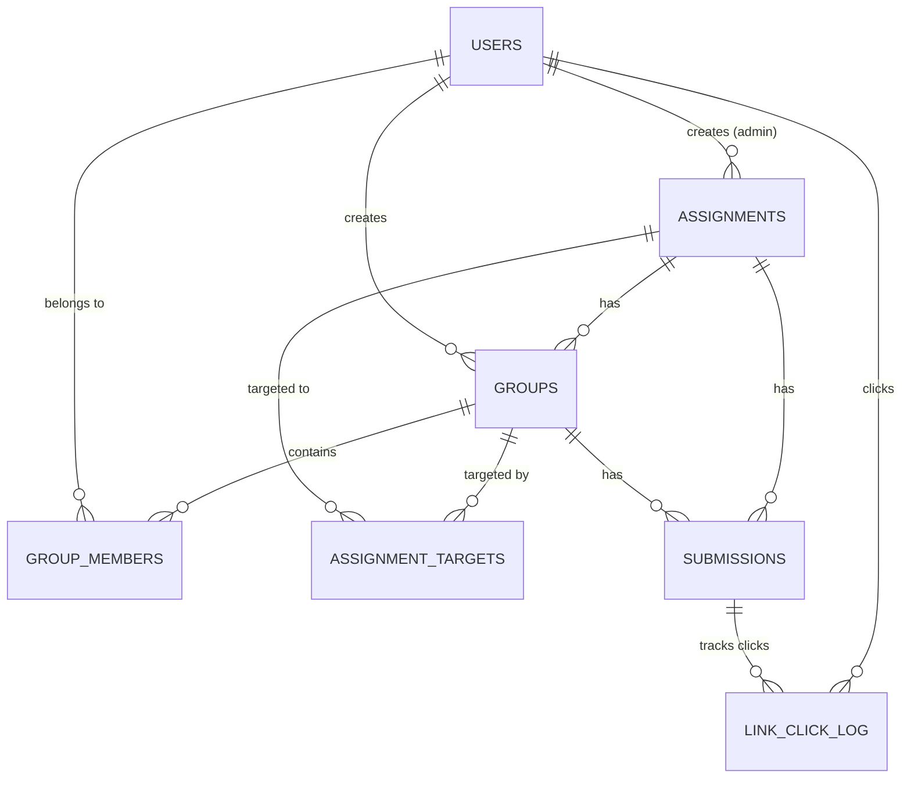

# JoinEazy

JoinEazy is a robust, full-stack Student, Group & Assignment Management System built to facilitate collaborative academic workflows.

The platform provides a strictly role-based UI (Student vs. Professor/Admin). Students can create groups, manage members, view assignments, and securely submit their work using a 3-gate verification flow. Professors can orchestrate dynamic assignments, determine strict target scopes, and effortlessly track group progress via an insightful RAG analytics dashboard.

## 🏗️ Architecture



## 🗄️ Database Schema



The database consists of 7 normalized tables designed to reliably enforce our domain constraints (e.g., student group exclusivity per assignment mapping).

*   `users`: Stores all participants along with their hashed credentials and core roles (`student` or `admin`).
*   `assignments`: Holds full specifics, scoping data, and deadlines.
*   `assignment_targets`: Enables fine-grained visibility rules beyond the default 'all' distribution.
*   `groups` & `group_members`: The core collaborative units and their composition.
*   `submissions`: The central state machine tracking workflow progression.
*   `link_click_log`: An indispensable audit trail capturing interaction with the external OneDrive payload.

## 🚀 Getting Started

### Prerequisites

*   Node.js (v20+)
*   Docker & Docker Compose (for containerized local development)
*   PostgreSQL (optional, if running locally without Docker)

### Environment Setup

Create the environment variables in the project component directories by copying from the template files:

```bash
# In the root repository
cp .env.example .env

# In the backend
cd backend
cp .env.example .env
# Edit backend/.env to add a secure JWT_SECRET and DATABASE_URL if not using Docker db

# In the frontend
cd ../frontend
cp .env.example .env
```

### Local Development (via Docker)

The easiest way to stand up the stack locally is by using Docker Compose.

```bash
# From the project root
docker-compose up --build
```
This automatically provisions:
1.  **Postgres Database** (Port 5432) — Auto-migrates using the `init.sql` schema.
2.  **Express Backend** (Port 4000)
3.  **React Frontend** (Port 5173)

### Local Development (Native)

For those preferring native terminal instances:

```bash
# 1. Start the Backend
cd backend
npm install
npm run dev

# 2. Start the Frontend
cd frontend
npm install
npm run dev
```

## 📡 API Reference

A highly curated list of endpoints designed for strict role-compliance.

| Endpoint | Method | Role | Description |
| :--- | :--- | :--- | :--- |
| **Auth** | | | |
| `/api/auth/register` | POST | Public | Creates student/admin accounts. Hashes passwords. |
| `/api/auth/login` | POST | Public | Verify credentials, issues strict HttpOnly JWT cookie. |
| `/api/auth/logout` | POST | All | Terminates JWT session. |
| `/api/auth/me` | GET | All | Validates token, retrieves self context. |
| **Assignments** | | | |
| `/api/assignments` | GET | Both | Context-aware listing (students only see targets). |
| `/api/assignments/:id` | GET | Both | Fetch granular specifics. |
| `/api/assignments` | POST | Admin | Distribute new assignments. |
| **Groups** | | | |
| `/api/assignments/:assignmentId/groups` | GET | Both | Group discovery layer. |
| `/api/assignments/:assignmentId/groups` | POST | Student | Form new groups (enforces max_members). |
| `/api/assignments/:assignmentId/groups/:groupId/members` | POST | Student | Leader-only mutation to recruit members. |
| **Submissions (3-Gate Workflow)** | | | |
| `/api/submissions/:id/track-click` | POST | Student | Gate 1: Logs traversal to external OneDrive. |
| `/api/submissions/:id/initiate` | POST | Student | Gate 2: Request tokenization for submit claim. |
| `/api/submissions/:id/confirm` | POST | Student | Gate 3: Finalizes intent, consumes verification token. |
| **Analytics** | | | |
| `/api/analytics/overview` | GET | Admin | Aggregated high-level statistics. |
| `/api/analytics/assignments/:id` | GET | Admin | Highly targeted Red/Amber/Green structural insights. |

## 🔑 Key Design Decisions

1.  **JWT inside HttpOnly Cookies over LocalStorage**: Drastically upgrades security posture by neutralizing XSS token theft vectors, while `SameSite=None` allows seamless interactions between distinct Vercel and Render environments.
2.  **3-Gate Submission Verification**: To combat the “I clicked submit but forgot to upload” phenomenon inherent to isolated OneDrive links, a multi-stage flow imposes an intentional cognitive barrier (cooldown + title confirmation pattern) maximizing submission authenticity.
3.  **Raw SQL vs. ORM**: Eschewing thick ORMs for standard `pg` queries maximizes database query transparency, tightens the schema directly through postgres primitives, and minimizes abstraction bloat.
4.  **Anti-AI-Slop Styling Principles**: A rigid "information-density-first" visual language leveraging strictly `DM Sans`, muted neutral grays, semantic borders, and surgical color accents (Red/Amber/Green badges). Avoids generic templates, blob SVGs, and bloated padding models.

## 🌍 Deployment Guide

### Database (Neon PostgreSQL)
1.  Navigate to Neon and provision a new Serverless Postgres project.
2.  Import `backend/src/db/migrations/001_init.sql` directly into their SQL editor.
3.  Secure the `DATABASE_URL` string.

### Backend (Render)
1.  Connect your GitHub repository to Render as a "Web Service".
2.  Root Directory: `backend`
3.  Build Command: `npm ci`
4.  Start Command: `node server.js`
5.  Set core environment variables:
    *   `DATABASE_URL` (From Neon)
    *   `JWT_SECRET` (Robust hash)
    *   `FRONTEND_URL` (Vercel Production Domain)

### Frontend (Vercel)
1.  Import your GitHub repository into Vercel.
2.  Root Directory: `frontend`
3.  Framework Preset: `Vite`
4.  Environment Variables:
    *   `VITE_API_URL` (Your exact Render production API URL)

## 📁 Project Structure

```text
JoinEazy/
├── backend/                     # Node.js + Express REST API
│   ├── src/
│   │   ├── config/              # Database and ENV validation mappings
│   │   ├── controllers/         # Core business logic orchestrators
│   │   ├── db/                  # Raw SQL Migrations and Seed data
│   │   ├── middleware/          # Security (Joi + JWT/RBAC Interceptors)
│   │   ├── routes/              # Explicit API Path Definitions
│   │   ├── services/            # Deep Data/Logic abstraction layer
│   │   └── utils/               # JWT parsers + Standard Error classes
│   ├── server.js                # App entrypoint
│   └── package.json
├── frontend/                    # React 18 / Vite Client architecture
│   ├── src/
│   │   ├── components/          # Sharable UI + Layout primitives
│   │   ├── context/             # Global Auth/Session Managers
│   │   ├── pages/               # Functional Views (Admin vs. Student scopes)
│   │   ├── services/            # Axios instance + Interceptor core
│   │   └── index.css            # Custom Design System Tokens
│   ├── tailwind.config.js       # Strict color limitations and font aliases
│   └── package.json
└── docker-compose.yml           # Local replica orchestration
```
