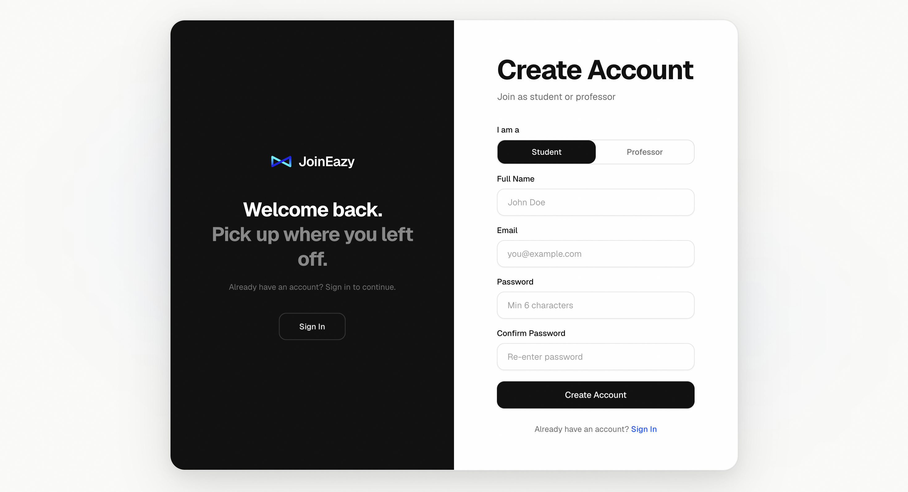
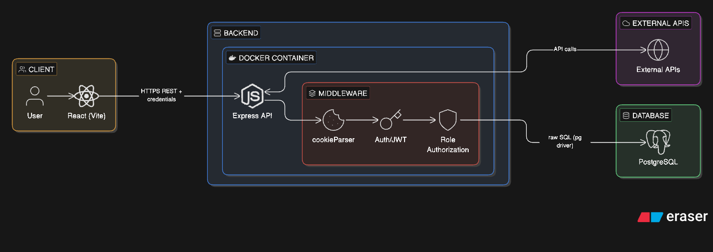
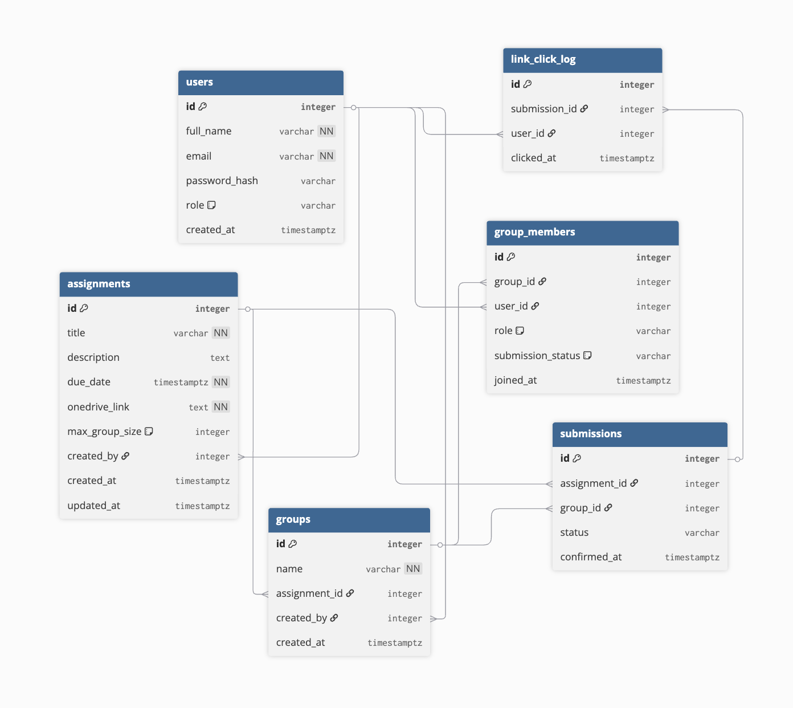

# JoinEazy

[](https://youtu.be/Q-T3hWM4b6M)

[](https://youtu.be/J4IZhhXzbFk)



A role-based full-stack web application for managing student groups, assignments, and submissions. Students form groups, manage members, and confirm assignment submissions through a secure multi-step verification flow. Professors create assignments, track group progress, and evaluate student work with per-student granularity.

## Overview of Implementation

- **Frontend**: Built with React (Vite) and Tailwind CSS for a responsive, modular UI.
- **Backend**: Node.js and Express RESTful API with route-level middleware for authentication and authorization.
- **Database**: PostgreSQL with raw SQL queries via the `pg` driver, enforcing complex constraints and triggers at the database level.
- **Auth**: JWT-based authentication using HttpOnly cookies to prevent XSS.

## UI/UX Design Overview
- The split auth layout keeps a strong brand presence while making the sign in and sign up paths feel distinct and easy to scan.
- Role-aware routing and navigation reduce clutter by showing students and professors only what they need.
- A token-based design system (CSS variables) keeps surfaces, borders, and typography consistent and simplifies theme switching.
- Soft gradients, glassy panels, and large radii add depth without overwhelming dense data views.
- Motion is used for orientation (staggered entrances and panel slides) and respects reduced-motion preferences for accessibility.

## Local Setup (Frontend + Backend)

### Prerequisites
- Node.js 18+ and npm
- PostgreSQL 16+

### Backend
1. Install dependencies:

```bash
cd backend
npm install
```

2. Create a .env file in backend/:

```dotenv
DATABASE_URL=postgresql://<user>:<password>@localhost:5432/joineazy_db
JWT_SECRET=dev_secret_change_in_production
FRONTEND_URL=http://localhost:5173
PORT=4000
```

3. Create the database (example):

```bash
createdb joineazy_db
```

4. Start the API (runs migrations on startup):

```bash
npm run dev
```

### Frontend
1. Install dependencies:

```bash
cd frontend
npm install
```

2. (Optional) Create a .env file in frontend/:

```dotenv
VITE_API_URL=http://localhost:4000/api
```

3. Start the app:

```bash
npm run dev
```

Open http://localhost:5173 in your browser.


## Architecture Overview



## Database Schema


